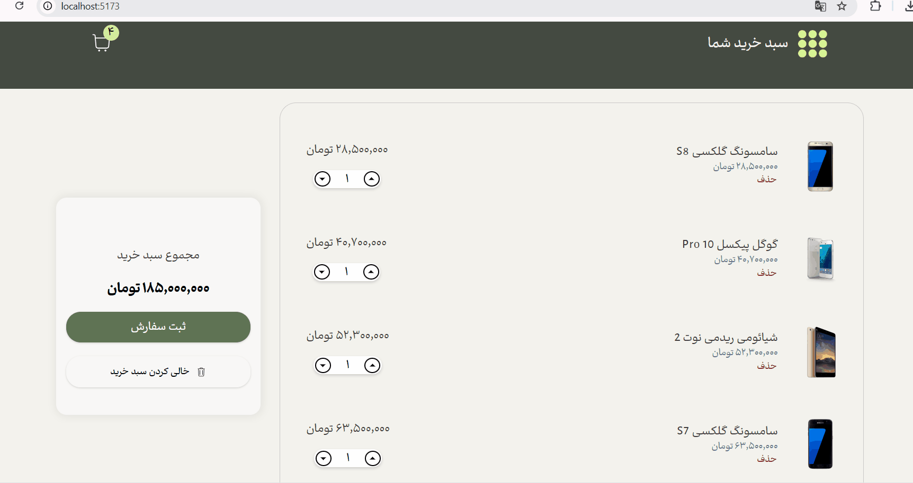
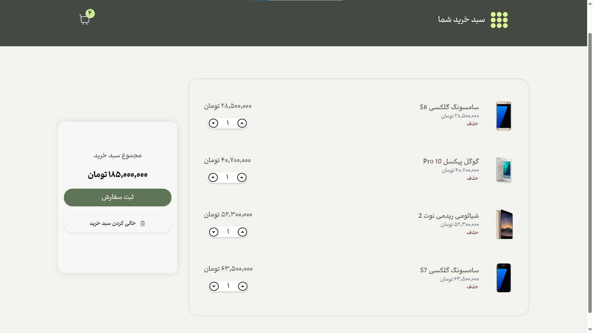
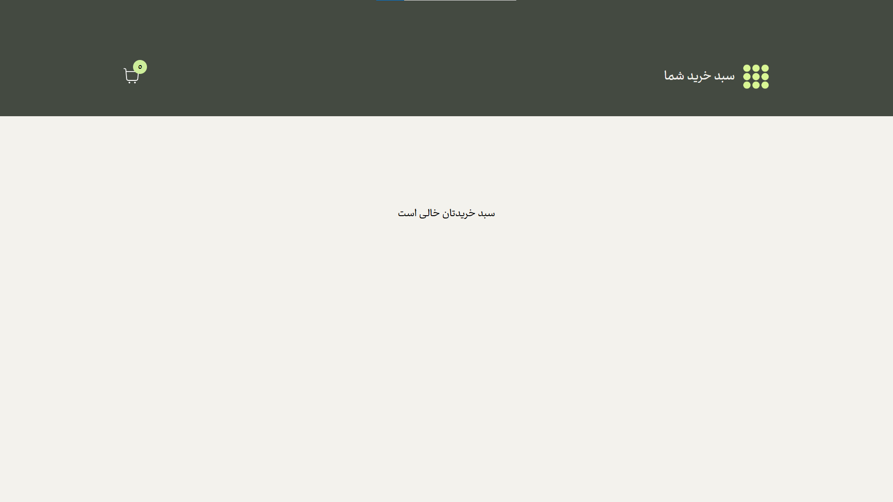

# Persian Shopping Cart

A responsive shopping cart application built with React and Vite.

The project is inspired by John Smilga's React Course Cart project, with changes to the UI, architecture, state management, responsiveness, and Persian localization.

## Screenshots and Demo



### Desktop View



### Empty Cart



## Features

- Fetches product data from a JSON Server API deployed on Render
- Increase or decrease product quantities
- Remove individual products
- Empty the cart
- Calculate and display the total cost
- Display the cart item count in the navbar
- Responsive layout
- Persian / RTL interface
- Loading spinner with react-spinners

## State Management

The application uses React Context API and useReducer for global state management and to avoid prop drilling.

## Technologies

- React 19
- Vite
- React Context API
- useReducer
- JSON Server
- react-icons
- react-spinners
- CSS
- JavaScript (ES6)

## Installation

```bash
npm install

## Development

npm run dev

## Build

npm run build

## Credits

Inspired by John Smilga's Cart project.
```
